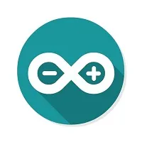

# [中文]（README_CN.md）
# Description
Currently, three development tools and frameworks—Arduino IDE, ESP-IDF, and PlatformIO—along with the UI design tool SquareLine Studio are provided, offering flexible development choices. You can select the appropriate tool based on project requirements and personal preferences.

# Development Tools Introduction
  
* **Arduino IDE**
  * Arduino IDE is an open-source electronic prototyping platform known for its convenience and ease of use. It requires minimal foundational knowledge, allowing users to start developing quickly after a brief learning period. Arduino boasts a vast global user community, providing extensive open-source code, project examples, tutorials, and rich library resources. These libraries encapsulate complex functionalities, enabling developers to implement various features rapidly.

* **ESP-IDF**
  * ESP-IDF (Espressif IoT Development Framework) is a professional development framework released by Espressif Systems for ESP-series chips. Developed in C, it includes compilers, debuggers, flashing tools, and more. It can be used via the command line or within integrated development environments (e.g., Visual Studio Code with the Espressif IDF plugin), which offers features like code navigation, project management, and debugging.

* **PlatformIO**
  * PlatformIO, based on Visual Studio Code (VSCode), leverages VSCode’s powerful extension capabilities to enable developers to directly invoke tools like GCC, J-Link, and GDB for development and debugging. PlatformIO is primarily an integrated development environment (IDE) and does not include substantial built-in functionality. Instead, it integrates compilers, debuggers, and other tools while using the Arduino framework. Compared to Arduino IDE, PlatformIO offers faster compilation times, clearer project structures, and better manageability. However, its steeper learning curve makes it less suitable for beginners.

* **UI Design Tool: SquareLine Studio**
  * SquareLine Studio, designed by Game-Ever, is a drag-and-drop UI editor for LVGL that allows users to quickly and easily create beautiful graphical user interfaces for embedded and desktop applications. After designing the interface, users can choose the export method—defaulting to a C/C++ project—which integrates seamlessly as a library or component within the project. SquareLine Studio offers affordable and flexible subscription plans tailored for both hobbyists and professionals.

These three development approaches each have their strengths, allowing developers to choose based on their needs and skill levels. Arduino is ideal for beginners and non-professionals due to its simplicity and ease of use. PlatformIO requires some basic knowledge. For developers with professional backgrounds or higher performance demands, ESP-IDF is the better choice, offering advanced tools and greater control for complex projects.

# Tutorial Quick Access

| Arduino Tutorial | ESP-IDF Tutorial | PlatformIO Tutorial | SquareLine Tutorial |
| :--------------- | :--------------: | :-----------------: | :-----------------: |
|  |  |  |  |
|  |  |  |  |

In this repository, we will introduce each of the three development environments and the UI design tool in detail—from installation to execution. We aim to provide comprehensive tutorials for newcomers and DIY enthusiasts and hope to assist everyone in their journey. We will continuously update and improve!
